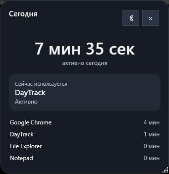

<div align="center">


# DayTrack

**A private, local-first activity tracker for Windows.**

Track how you use your PC without creating an account, sending activity to the cloud, or relying on an external tracking service.


</div>

---

## Overview

DayTrack is a lightweight Windows desktop application that collects useful activity statistics locally and presents them through a desktop widget, dashboard, daily reports, and exports.

The application is designed around a simple principle: **your activity data stays on your PC**.

No DayTrack account is required. There is no DayTrack cloud backend, telemetry service, or remote activity database.

## Features

- Active time per application
- Active / AFK tracking
- PC uptime tracking
- Windows lock / unlock awareness
- Sleep / resume tracking
- Aggregate keyboard press counter
- Aggregate mouse click counter
- Aggregate network traffic totals
- Basic application launch counting
- Desktop activity widget
- Dashboard for Today / 7 days / 30 days / All time
- Pause / resume tracking from the tray
- Windows autostart
- Automatic daily text reports
- CSV and JSON exports
- Local SQLite database
- Local database backups
- Dark, Light, and System themes
- English, Russian, Ukrainian, Japanese, and Simplified Chinese
- Portable and installer distributions

## Privacy by Design

DayTrack does **not** store:

- individual keyboard keys;
- typed text;
- passwords;
- clipboard contents;
- mouse coordinates;
- screenshots;
- network packet contents.

Keyboard and mouse hooks are used only to increment aggregate numeric counters.

Network tracking stores byte totals from active network interfaces. It does not inspect packet contents and does not provide per-application network usage.

DayTrack's current activity database stores application names and aggregate usage statistics. Window titles are not persisted by the current release.

For more details, see [PRIVACY.md](PRIVACY.md).

## Screenshot



## Installation

### Option 1 — Installer

Download the latest file named similar to:

```text
DayTrack-Setup-v1.0.0-win-x64.exe
```

Run the installer and follow the setup wizard.

The installer can:

- add DayTrack to Start Menu / All apps;
- optionally create a desktop shortcut;
- register a standard Windows uninstaller;
- launch DayTrack after installation.

DayTrack user statistics are intentionally preserved when the application is uninstalled.

### Option 2 — Portable

Download:

```text
DayTrack-v1.0.0-Portable-win-x64.zip
```

Extract the archive to a folder and run:

```text
DayTrack.exe
```

The portable distribution does not require a traditional installation.

> **Note:** DayTrack still stores its application data in `%LOCALAPPDATA%\DayTrack`. "Portable" means the application itself can be run without installing it.

## First Run

On the first launch, DayTrack lets you configure:

- interface language;
- theme;
- daily report location;
- Windows autostart;
- keyboard press counting;
- mouse click counting;
- shortcut options.

After setup, the tracker can continue running from the Windows notification area.

## Data Storage

The primary local database is stored at:

```text
%LOCALAPPDATA%\DayTrack\data.db
```

DayTrack also keeps local history/backups under:

```text
%LOCALAPPDATA%\DayTrack\
```

Daily readable reports are written to the folder selected during setup. DayTrack creates its own `DayTrack` subfolder there.

## Exports

DayTrack can export application statistics as:

- TXT daily reports
- CSV
- JSON

The SQLite database remains the primary source of stored statistics.

## System Requirements

- Windows 10 or Windows 11
- x64 system

Public release builds are self-contained, so users do not need to install the .NET runtime separately.

## Technology

- C#
- .NET 8
- WPF
- Windows Forms notification icon
- Win32 APIs
- SQLite (`Microsoft.Data.Sqlite`)
- Inno Setup for the Windows installer

## Build from Source

Requirements:

- .NET SDK with .NET 8 targeting support
- Windows x64
- Inno Setup 6 (only required for building the installer)

Debug build:

```bat
BUILD_DEBUG.cmd
```

Complete public release:

```bat
BUILD_PUBLIC_RELEASE.cmd
```

The public release script creates files in:

```text
dist\
```

Expected artifacts:

```text
DayTrack-v1.0.0-Portable-win-x64.zip
DayTrack-Setup-v1.0.0-win-x64.exe
SHA256SUMS.txt
```

If Inno Setup is not installed, the Portable package is still created.

## Known Limitations

- Application launch counts are based on periodic process sampling and can miss very short-lived processes.
- Network statistics are aggregate adapter totals, not per-application traffic.
- DayTrack currently targets Windows x64.
- Public binaries are not code-signed, so Windows SmartScreen may show an "unknown publisher" warning.

## Project Status

**v1.0.0** is the first public release candidate based on the tested standalone DayTrack build.

Core tracking, first-run setup, Portable mode, installer, Windows autostart, and uninstall flow have been tested on a Windows system before preparing this release.

## License

DayTrack is released under the [MIT License](LICENSE).
